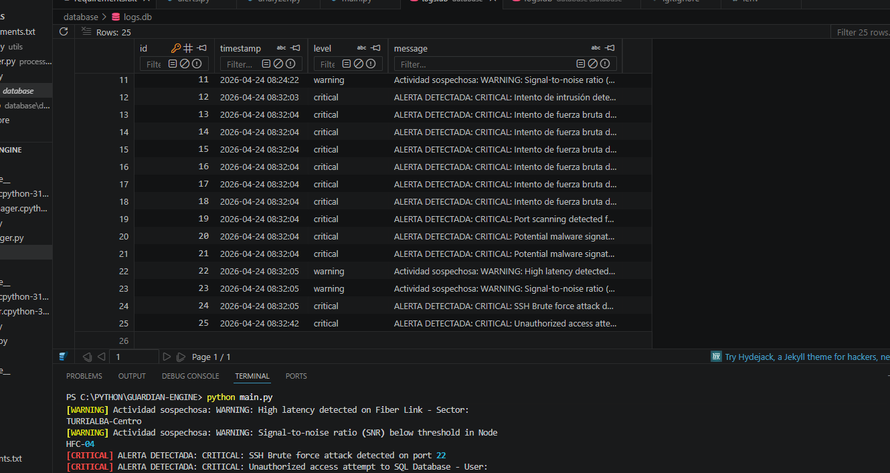

# 🛡️ Guardian-Engine v1.0
**Real-Time Security Orchestration & Network Monitoring Engine**

[](https://www.python.org/)
[](https://www.gnu.org/licenses/gpl-3.0)
[](https://github.com/tu-usuario)
 

## 👤 Autor
**Yananth Fajardo Moya** *Técnico Infraestructura de Redes y Desarrollador de Herramientas de Ciberseguridad**

---

## ⚠️ PRO PROFESSIONAL DISCLAIMER / DESCARGO DE RESPONSABILIDAD
> **Este proyecto fue desarrollado con fines exclusivamente educativos y de aprendizaje.** > 
> Guardian-Engine es una prueba de concepto (PoC) diseñada para demostrar habilidades en programación con Python, automatización de eventos y manejo de bases de datos. No debe ser utilizado como única medida de defensa en entornos de producción críticos sin previa auditoría y endurecimiento (hardening) profesional. 
> 
> El uso de este software para el monitoreo de redes debe realizarse siempre bajo el marco de la legalidad y con el consentimiento explícito de los propietarios de la infraestructura. El autor no se hace responsable por el mal uso de esta herramienta.

---

## 📖 Descripción
**Guardian-Engine** es un motor de procesamiento de eventos de seguridad desarrollado en Python. Diseñado bajo una arquitectura **Event-Driven**, este sistema actúa como el núcleo central de defensa, monitoreando logs en tiempo real para detectar, analizar y registrar amenazas en la infraestructura de red.

Este proyecto es la pieza central del ecosistema de herramientas de **"The Network-Guardian"**, enfocado en la transición hacia la ciberseguridad defensiva. 

## 📸 Evidencia )de Funcionamiento (PoC)
<p align="center">
  
  <br>
  <i>Captura del motor detectando y registrando alertas en tiempo real.</i>
</p>

## 🚀 Características Principales
* **Monitoreo en Tiempo Real:** Utiliza la librería `watchdog` para detectar cambios en los logs en milisegundos mediante señales del Sistema Operativo.
* **Análisis de Hilos de Log:** Algoritmo capaz de escanear y procesar múltiples líneas de forma secuencial, clasificando eventos en `INFO`, `WARNING` y `CRITICAL`.
* **Persistencia Forense:** Integración con **SQLite** para el almacenamiento estructurado de alertas, garantizando que el historial de eventos sea persistente y auditable.
* **Seguridad por Diseño:** Implementación de variables de entorno (`.env`) para proteger rutas de archivos y configuraciones sensibles del sistema.

## 🛠️ Stack Tecnológico
* **Lenguaje:** Python 3.14
* **Base de Datos:** SQLite3
* **Librerías Clave:** `watchdog`, `python-dotenv`, `pandas`
* **Arquitectura:** Orientada a Eventos (Event-Driven)

## 📂 Estructura del Proyecto
```text
GUARDIAN-ENGINE/
├── main.py              # Orquestador principal del motor
├── .env                 # Configuración de entorno (Excluido de Git)
├── database/            # Capa de datos y gestión de SQLite
│   ├── db_manager.py    # Lógica de escritura y lectura en DB
│   └── logs.db          # Base de datos local
├── processor/           # Lógica de análisis y clasificación de logs
└── alerts.log           # Canal de entrada de eventos monitoreados  


